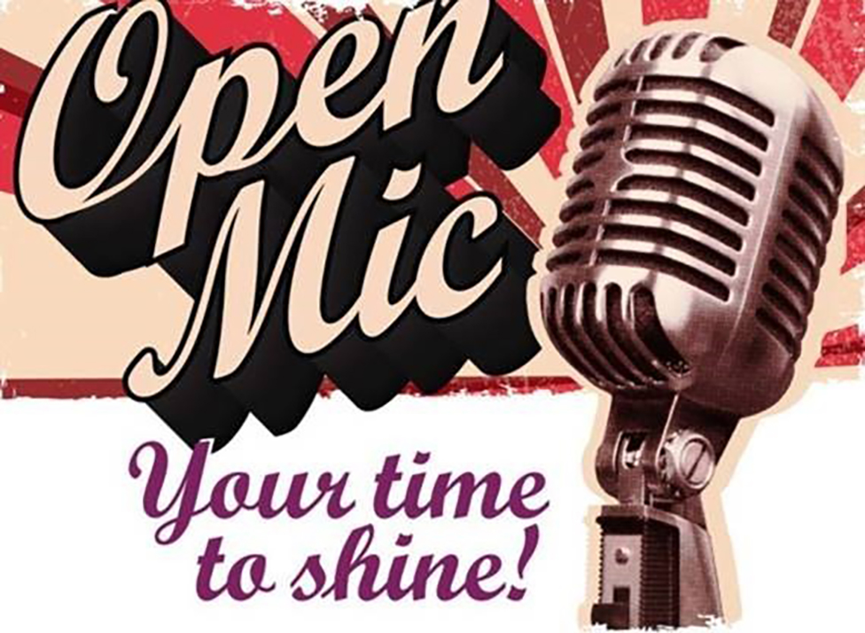
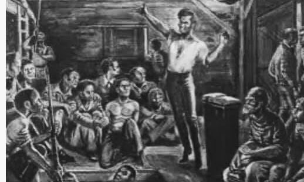

<!doctype html>
<html>
<head>
<meta charset="utf-8">
<title>index.html</title>
<meta charset="utf-8"> 

    <meta name content="viewport" http->

<!--The following script tag downloads a font from the Adobe Edge Web Fonts server for use within the web page. We recommend that you do not modify it.-->

</head>
<body>
<headed>  
  
<ul>
  <li><a href="default.asp"><u>Home</u></a></li>
  <li><a href="news.asp"><u>H.L.R.T.</u></a></li>
  <li><a href="contact.asp"><u>Contact</u></a></li>
  <li><a href="about.asp"><u>About</u></a></li>
  

    <u></u>    <a href="https://www.poetryfoundation.org/" tabindex="1" title="About" target="_blank">THE  ROUNDTABLE</a> PRESENTS: <u>POETRY NIGHT</u>

  
Pellentesque habitant morbi tristique et netus et 
    malesuada fames ac turpis egestas. Vestibulum tortor quam, feugiat vitae, ultricies eget, tempor sit amet, ante. Donec eulibero sit amet quam egestas semper. AeneContent for New aside Tag Goes Herean ultricies mi 
    vitae est. Mauris placerat eleifend leo. Quisque sit amet est et sapien ullamcorper pharetra.<a href="https://www.poetryfoundation.org/" tabindex="1" title="About" target="_blank">VOLUNTEERS</a>
DONATATIONS: &euro;
 

  </ul>
  

</headed>
<h3>Pellentesque habitant morbi tristique et netus et 
malesuada fames ac <a href="https://www.poetryfoundation.org/" tabindex="1" title="About" target="_blank">THE <strong><em>ROUNDTABLE </em></strong></a><a href="https://www.poetryfoundation.org/" tabindex="1" title="About" target="_blank">VOLUNTEERS</a></h3>
<h3>turpis egestas. Vestibulum tortor quam, feugiat vitae, ultricies eget, tempor sit amet, ante. Donec eulibero sit amet quam egestas semper. AeneContent for New aside Tag Goes Herean ultricies mi 
  vitae est. Mauris placerat eleifend leo. Quisque sit amet est et sapien ullamcorper pharetra.</h3>
<aside></aside>
<h1><a href="file:///C|/Users/Otsloan1/index.html"><strong>NEWSLETTER</strong></a></h1>
<article class="art-1-home"/>
<nav></nav>
<aside></aside>
<main>
  <section class="feature-images"></section>
  <article class="VOLUNTEER"/>
</main>
<a href="https://www.poetryfoundation.org/" tabindex="1" title="About" target="_blank">CONTACT</a>

 copyright© 2021 H.R.L.T

</body>
</html>
    